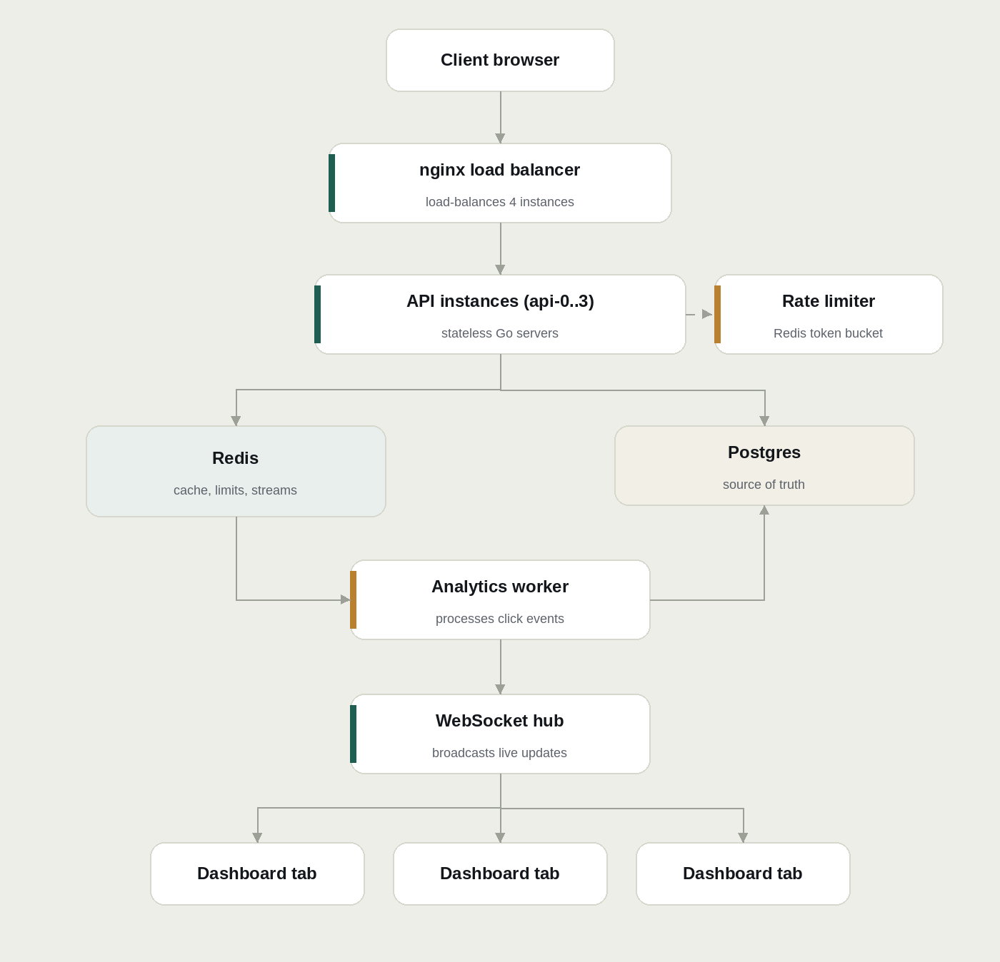

# Quorum: A Distributed URL Shortener with Real-Time Analytics

A URL shortener built the way a distributed system should be: not just a hash-and-store CRUD app, but one designed around the questions that actually show up at scale. How do multiple nodes generate unique IDs without coordinating? How does a redirect stay fast while analytics happen somewhere else entirely? What happens when a worker crashes mid-event?

Quorum answers those by actually being distributed: 4 stateless API instances behind a load balancer, a Redis-backed analytics pipeline decoupled from the hot redirect path, and a token bucket rate limiter that stays correct even when it's enforced across every instance at once.

## What it does

- Paste in a long URL and get a short one back, generated via a collision-free, coordination-free **Snowflake ID** (timestamp + node ID + sequence, base62-encoded), not an auto-increment counter that breaks the moment you run more than one instance.
- Every click is tracked **asynchronously**: the redirect never waits on analytics. A background worker pool consumes click events off a Redis Stream, updates Postgres, and maintains a time-decayed **trending score**.
- A live dashboard reflects link activity in real time over WebSockets.
- All of it is rate-limited per client, load-balanced across multiple instances, and tested for the exact failure modes that only show up in a distributed setup.

## Architecture



**The core design decision:** everything above the Redis/Postgres line is stateless and horizontally scaled. Everything below it is the single shared source of truth. The redirect path (top half) and the analytics path (bottom half) never block each other; a slow or crashed analytics worker has zero effect on redirect latency.

## Tech stack

| Layer          | Choice                                                      | Why                                                                                      |
| -------------- | ----------------------------------------------------------- | ---------------------------------------------------------------------------------------- |
| Backend        | Go, [chi](https://github.com/go-chi/chi)                    | Idiomatic middleware chaining, stdlib-compatible                                         |
| Database       | PostgreSQL + [sqlc](https://sqlc.dev)                       | Type-safe generated queries, no ORM magic                                                |
| Cache / queue  | Redis (cache-aside, Streams, Pub/Sub, ZSET, rate limiting)  | One tool, five jobs: cache, async queue, leaderboard, atomic counters, and Pub/Sub relay |
| Load balancing | nginx                                                       | Explicit, inspectable config over a managed black box                                    |
| Real-time      | Native WebSockets + Redis Pub/Sub relay                     | Redis Pub/Sub bridges updates across worker and API processes to local WebSocket hubs    |
| Frontend       | React, TypeScript, Vite, Tailwind CSS v4, Bun               | Fast dev loop, modern CSS-first theming                                                  |
| Migrations     | [golang-migrate](https://github.com/golang-migrate/migrate) | Versioned, reversible schema changes                                                     |
| CI             | GitHub Actions                                              | Tests + build on every push, Postgres/Redis spun up as services                          |

## API

| Method | Endpoint        | Description                                                              |
| ------ | --------------- | ------------------------------------------------------------------------ |
| `POST` | `/shorten`      | Create a short code for a long URL                                       |
| `GET`  | `/{code}`       | Redirect to the original URL (cache-aside: Redis, then Postgres on miss) |
| `GET`  | `/stats/{code}` | Current click count, trending score, and metadata for a short link       |
| `GET`  | `/health`       | Reports Postgres and Redis connectivity                                  |
| `GET`  | `/ws`           | Upgrade to WebSocket connection for live dashboard telemetry             |

## Concurrency & performance

Load tested with [k6](https://k6.io) against the full stack: nginx, 4 API instances, Redis, Postgres, and the analytics pipeline running concurrently.

- **120 req/s sustained** against the redirect endpoint
- **Sub-millisecond p95 redirect latency** on the cache-aside hit path
- **Zero processing lag** on the analytics stream: click events were consumed and reflected in trending scores as fast as they were produced, even under load
- **3 concurrent analytics workers** consuming from a Redis Streams consumer group, with automatic crash recovery via `XAUTOCLAIM` (a worker that dies mid-processing has its unacknowledged events picked up by another worker, not lost)
- Rate limiting enforced via an **atomic Redis Lua script**, correct under concurrent requests hitting different API instances simultaneously, with zero race condition between the check and the token spend

### Running the benchmarks

You can reproduce these benchmarks against the local stack with the included k6 test script:

```bash
# run the benchmark suite (defaults: 120 req/s sustained for 30s)
task test:load

# or directly with k6
k6 run test/k6_test.js

# customize target throughput and duration
TARGET_RPS=200 DURATION=60s k6 run test/k6_test.js
```

## Local setup

**Requirements:** Docker, [Go](https://go.dev), [Task](https://taskfile.dev), [Bun](https://bun.sh)

```bash
# clone and enter the project
git clone <repo-url> && cd url-shortener

# copy environment variables for local tooling/migrations
cp server/.env.example server/.env

# start Postgres, Redis, nginx, 4 API instances, and 3 analytics workers
docker compose up -d --build

# run database migrations
task migrate:up

# confirm everything is healthy
curl localhost/health
```

**Run the frontend:**

```bash
cd web/dashboard
bun install
bun run dev
```

Open the printed local URL. The dev server proxies `/shorten`, `/stats`, and `/ws` to nginx on port 80.

**Try it:**

```bash
curl -X POST localhost/shorten \
  -H "Content-Type: application/json" \
  -d '{"long_url":"https://example.com"}'
```

## Project structure

```
url-shortener/
├── docker-compose.yml
├── nginx.conf
├── Taskfile.yml
├── docs/                           # architecture diagrams & design assets
├── server/
│   ├── cmd/{api,worker,migrate}/   # three independently deployable binaries
│   ├── internal/
│   │   ├── analytics/              # stream producer/consumer, trending score
│   │   ├── cache/                  # Redis cache-aside
│   │   ├── config/                 # environment & application configuration
│   │   ├── database/               # PostgreSQL connection pool & sqlc queries
│   │   ├── handler/                # HTTP & WebSocket route handlers
│   │   ├── hub/                    # WebSocket Hub/Client pattern & Redis Pub/Sub bridge
│   │   ├── logger/                 # structured logging setup (slog)
│   │   ├── middleware/             # rate limiting, request ID, structured logging
│   │   ├── ratelimit/              # atomic token bucket (Lua script)
│   │   ├── routes/                 # Chi router and route registration
│   │   ├── shortener/              # Snowflake ID generation, base62, core service
│   │   └── utils/                  # JSON response & error formatting helpers
│   ├── migrations/                 # versioned, up/down pairs
│   └── queries/                    # sqlc source queries
├── test/                           # k6 load testing & benchmark scripts
└── web/dashboard/                  # React + TS + Tailwind frontend
```

## Why these design decisions

- **Snowflake IDs over auto-increment or random-with-retry**: auto-increment breaks the moment you run more than one instance; random-with-collision-check wastes a DB round trip per request. Snowflake lets every node generate unique IDs with zero coordination.
- **Redis Streams over a heavier broker (Kafka/NATS)**: this project's scale doesn't need a dedicated message broker. Streams gives consumer groups, at-least-once delivery, and crash recovery with infrastructure already running.
- **Cache-aside, not write-through-only**: the redirect path degrades gracefully, falling back to Postgres, if Redis is ever unavailable, rather than failing outright.
- **Anonymous links by default**: no user accounts in v1. This keeps the project's focus on distributed-systems correctness rather than auth, which is deliberately scoped out for now.
